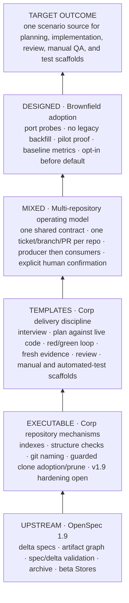

# Corp SDD vs vanilla OpenSpec

Updated: 2026-08-19. The OpenSpec side was audited against the official
[`v1.9.0`](https://github.com/Fission-AI/OpenSpec/tree/v1.9.0) tag. The Corp SDD side
comes from the shipped commands, skills, scripts, configuration, and rollout guides in this
repository — not from the presentation.

The existing presentation at `docs/index.html` is intentionally unchanged.

## Positioning

**OpenSpec formalizes the change. Corp SDD adds the delivery operating model around it.**

Corp SDD is not a replacement for OpenSpec. It uses OpenSpec as the specification engine and adds
an opinionated delivery model for multi-repository brownfield products, several engineering roles,
restricted networks, and self-hosted agents. The model is partly executable and partly a set of
templates that still needs a corporate-port pilot.

The status words matter. `EXECUTABLE` means code exists and has run on local or synthetic fixtures;
it does not mean every OpenSpec 1.9 path is correct. `TEMPLATES` and `DESIGNED` mean the target agent
CLI, tracker, Git host, and CI still need adaptation and a real pilot.

## OpenSpec 1.9 compatibility gate

The comparison uses current vanilla OpenSpec 1.9, but the Corp SDD integration was originally
tested against 1.7. A fresh 1.9 runtime audit found three P0 categories that must close before this
starter can claim 1.9 compatibility:

1. **Make store, root, and reference resolution healthy.** For a new path, use
   `openspec store setup`, which creates and registers the store. For an existing skeleton,
   initialize a healthy OpenSpec root and then use `store register`. Compare the canonical Git root with the actual
   `openspec context --json` root instead of emulating OpenSpec resolution. Resolve referenced store
   members and paths from that JSON, supporting both scalar and object-form references. The current
   root guard can false-pass an empty `openspec/` and false-fail on macOS `/tmp` vs `/private/tmp`;
   the split-brain parser silently misses object-form references.
2. **Prove the approved active contract bytes are visible.** Record the store change ID, branch,
   commit, digest, and pull request on every child. Before consumer work, require a clean registered
   store worktree whose `HEAD` equals that commit, then prove
   `openspec show <change-id> --type change --store <id>` succeeds. Isolate concurrent active contracts with a
   worktree/store-ID strategy. If the contract changes, stop consumers and record a new commit and
   digest. Extend split-brain checking to the active delta: it currently fingerprints only living
   specs and is blind before archive. Switch to the canonical spec ID only after archive.
3. **Align the agent workflow and full lifecycle.** Configure a custom workflow selection including
   `verify`, run `openspec update`, and use Qwen's actual `/opsx-verify` invocation. Use stable CLI
   calls for `openspec new change` and `openspec archive`; stock propose closes the default required
   artifact set through tasks and may create design earlier than Corp SDD's delayed plan. Finally,
   align the archive commit template with the naming hook: the current documented archive subject is
   rejected by the shipped gate.

## Capability boundary

| Capability | Vanilla OpenSpec 1.9 | Corp SDD addition | Current maturity |
|---|---|---|---|
| Specification lifecycle | Delta and living specs, customizable artifact graph, spec/delta validation, archive; status reports artifact presence/dependency state | Reuses the upstream lifecycle; does not invent another spec format | Upstream |
| Delivery flow | Apply follows tasks; optional verify heuristically searches code/tests for evidence | Seven role commands: analyst interview, live-code plan, implementation, review, manual test plan, test scaffolds, archive | Templates; pilot required |
| Engineering discipline | Does not prescribe a required red/green loop or built-in test command | Five skills specify tiered test-driven development, root-cause debugging, fresh evidence, and review order | Templates; advisory until target CI enforces outcomes |
| Git, pull requests, and tracker | Normal project workflows do not branch, commit, push, pull, open PRs, or automate tracker lifecycle; setup-time `store setup` may initialize Git | `corp-spec` defines tracker-to-branch-to-PR handoff and guarded fan-out | Template; no bundled tracker or PR client |
| Executable repository controls | `openspec validate` checks spec/delta structure | Nine Node/bash scripts generate and aggregate indexes, check structure and git names, and perform guarded clone adoption/prune inside the configured clone root | Executable on local/1.7-era fixtures; OpenSpec 1.9 resolver/active-delta hardening required |
| Multiple repositories | Beta Stores provide registered read-only references and local worksets | System catalog, shared-contract ownership, producer/consumer order, and one work item per repository | Some tools executable; active-contract visibility and end-to-end fan-out not yet piloted |
| Corporate adoption | Tool initialization and team conventions | Port-discovery probes, evidence log, no-backfill onboarding, baseline metrics, staged opt-in rollout, explicit hold/rollback gates | Designed; timings and outcomes unmeasured |

Official OpenSpec evidence: [team workflow](https://github.com/Fission-AI/OpenSpec/blob/v1.9.0/docs/team-workflow.md),
[Stores beta guide](https://github.com/Fission-AI/OpenSpec/blob/v1.9.0/docs/stores-beta/user-guide.md),
[apply template](https://github.com/Fission-AI/OpenSpec/blob/v1.9.0/src/core/templates/workflows/apply-change.ts),
[verify template](https://github.com/Fission-AI/OpenSpec/blob/v1.9.0/src/core/templates/workflows/verify-change.ts), and
[CLI reference](https://github.com/Fission-AI/OpenSpec/blob/v1.9.0/docs/cli.md).

Corp SDD evidence: [`corp-spec`](en/commands/corp-spec.md),
[`corp-implement`](en/commands/corp-implement.md),
[`corp-review`](en/commands/corp-review.md),
[`corp-tdd`](en/skills/corp-tdd/SKILL.md),
[`verify-docs.sh`](en/scripts/tools/verify-docs.sh),
[`corp-lint.mjs`](en/scripts/tools/corp-lint.mjs),
[`check-contract-split-brain.mjs`](en/scripts/tools/check-contract-split-brain.mjs), and
[`sync-repos.sh`](en/scripts/tools/sync-repos.sh).

## Onboarding: prove first, then scale

1. **Discover the corporate port and pin once.** Run probes P1–P8 for config, commands, skills, MCP,
   headless mode, gateway, context file, and OpenSpec adapter. Close and negatively test the three
   1.9 readiness categories above for the chosen version, then pin it. Commit the evidence. The guide's half-day
   estimate is not yet measured in the target environment.
2. **Build the foundation once.** Mirror and pin OpenSpec, establish the system store, configure a
   narrow clone root, review guarded adoption/prune of existing clones, register the store on developer and CI machines, connect tracker/wiki/LSP, and
   capture baseline delivery and developer-experience metrics.
3. **Onboard each pilot repository without backfill.** Give it its own OpenSpec root, install the
   six spoke scripts, generate `repo.txt` and the empty living-spec index, add commands/skills and
   hooks, then deliberately break every gate and observe the failure. The `~1 hour/repo` figure is a
   mechanical estimate after prerequisites, not a measured total rollout time.
4. **Prove real work and the new failure classes.** Re-run the documented guard matrix in the target
   environment. Also prove healthy 1.9 store registration, canonical root equality, scalar/object
   references, clean store `HEAD` equality, active-change bytes and lint, an accepted archive commit, and tracker unblocking on
   contract approval. Complete one small single-repo story and one two-repo story. Store every
   command result in `IMPLEMENTATION-LOG.md`; fix harness friction before blaming users.
5. **Scale only on evidence.** Phase 0 establishes foundation and baselines. Phase 1 stays opt-in.
   Expansion requires sustained voluntary use, green indexes without manual repair, and quality and
   review metrics at least as good as baseline. Default and required modes keep an exception and
   rollback path.

Detailed sources: [implementation guide](en/docs/2026-07-18-corp-sdd-implementation-guide.md),
[implementer handoff](en/docs/2026-07-18-corp-sdd-handoff-to-coder-agent.md), and
[setup task](en/docs/2026-08-04-corp-sdd-setup-task-for-agent.md).

## Claim boundary

- The public kit ships no end-to-end target-environment test or measured business outcome.
- Commands and skills are Markdown templates. They do not mechanically prove that a test ran before
  code, that evidence is fresh, or that a merge order was followed.
- The split-brain guard catches matching requirement headings and exact multi-line fenced blocks; it
  does not understand semantic paraphrases or active store deltas, and an unregistered store warns
  without blocking. Official object-form references are currently a false-negative.
- Multi-repository fan-out still needs a real pilot, including approved-contract visibility before
  the store change merges and tracker blocking semantics.
- The archive command's documented commit subject currently conflicts with the naming hook.
- Clone adoption/prune has data guards inside the configured clone root, but that root itself is not
  constrained against an overly broad path.
- The current starter is not yet OpenSpec 1.9 compatible until the three P0 categories above close.
- For one small repository with one role and no shared contracts, vanilla OpenSpec may be enough.

There is no defensible evidence for an objective “best on market” claim today. The supportable claim
is narrower and stronger: **Corp SDD is designed as an OpenSpec-based delivery control plane for
multi-repository brownfield teams in restricted, self-hosted environments; OpenSpec 1.9 compatibility
is pending the stated gates.** A pilot must prove the outcome against the team's own baseline.
